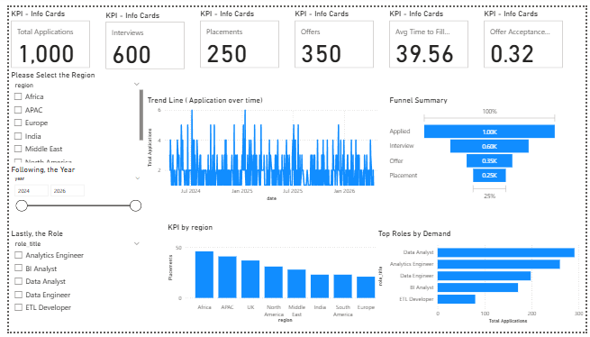
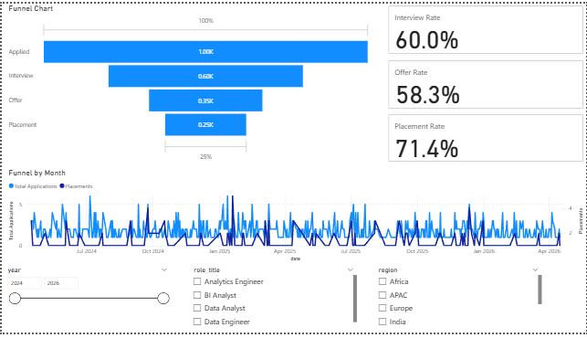
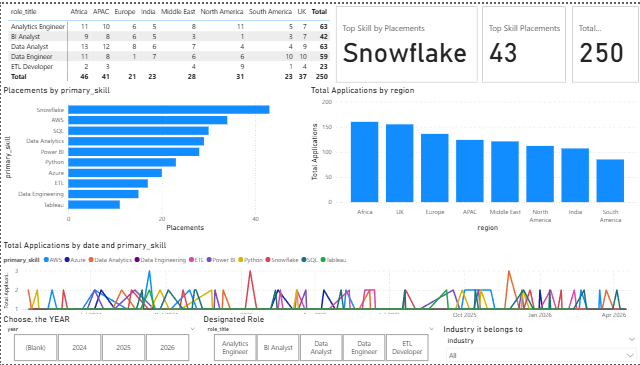
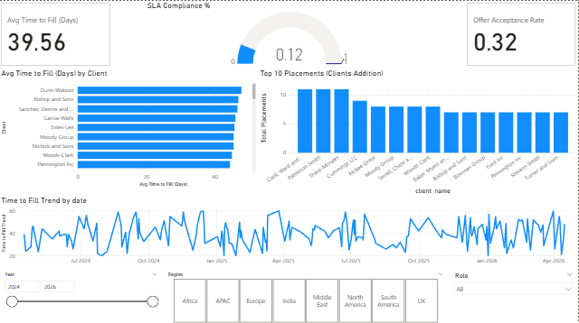
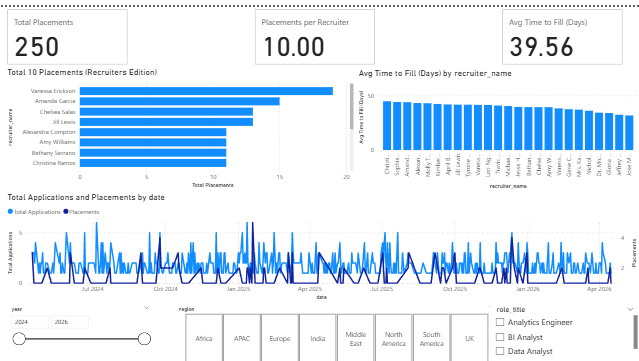

# Executive Recruiting Analytics Dashboard (Power BI)

## 📌 Objective
Build an executive‑level analytics dashboard to monitor the **full recruiting pipeline** — from applications to placements — with a focus on **time‑to‑fill**, **conversion efficiency**, **skill demand**, and **regional/client performance**.  
The dashboard supports leadership decisions by highlighting bottlenecks, SLA risks, and high‑impact roles/skills.

---

## 🏢 Business Context (Company Alignment)
This project aligns with the work of a **global recruiting firm**-**Hireflex247** that delivers talent across regions and industries.  
The dashboard is designed to:
- Track pipeline health in real time  
- Improve **SLA compliance**  
- Optimize recruiter performance  
- Prioritize **high‑demand skills** and roles  

---

## 📊 Dashboard Pages

### **Page 1 — Executive Overview**
- Total Applications, Interviews, Offers, Placements  
- Avg Time to Fill  
- Offer Acceptance Rate  
- Trend line + regional performance + top roles

### **Page 2 — Recruiting Funnel**
- Full funnel drop‑off  
- Interview, Offer, Placement rates  
- Monthly applications vs placements

### **Page 3 — Skill & Region**
- Skill heatmap (roles × region)  
- Top skills by placements  
- Applications by region  
- Skill demand trend

### **Page 4 — Client SLA & Time‑to‑Fill**
- SLA compliance gauge  
- Avg Time‑to‑Fill by client  
- Top client placements  
- Time‑to‑fill trend

### **Page 5 — Recruiter Performance**
- Placements per recruiter  
- Avg time‑to‑fill by recruiter  
- Placement trend by month

---

## 📌 Key Insights
- **1,000 applications → 250 placements** (25% conversion overall).  
- **Offer Acceptance ~32%**, showing drop‑off at final stage.  
- **Avg Time to Fill ~40 days**, well above a 30‑day SLA.  
- **SLA Compliance only ~12%**, signaling high operational risk.  
- **Top skill: Snowflake (43 placements)**.  
- Recruiter output is uneven, indicating optimization opportunity.

---

## 📁 Data Source
Synthetic recruiting dataset created to simulate a real global staffing pipeline. .py script attested/uploaded.

**Includes:**
- Applications  
- Interviews  
- Offers  
- Placements  
- Clients & Regions  
- Recruiters  
- Roles & Skills  
- Dates

---

## 🧠 Core Measures (Examples)
- **Total Applications**
- **Total Placements**
- **Offer Acceptance Rate**
- **Avg Time to Fill (Days)**
- **SLA Compliance %**
- **Top Skill by Placements**

---

## 🛠 Tools Used
- **Power BI**
- DAX for measures
- Data modeling with star schema

---

## ✅ How to Use
1. Download `.pbix` file  
2. Open in Power BI Desktop  
3. Explore filters by year, region, role, client, recruiter  

---
## Work-Proof 

  
  
  
  
  

---

## 📬 Credits : Me
